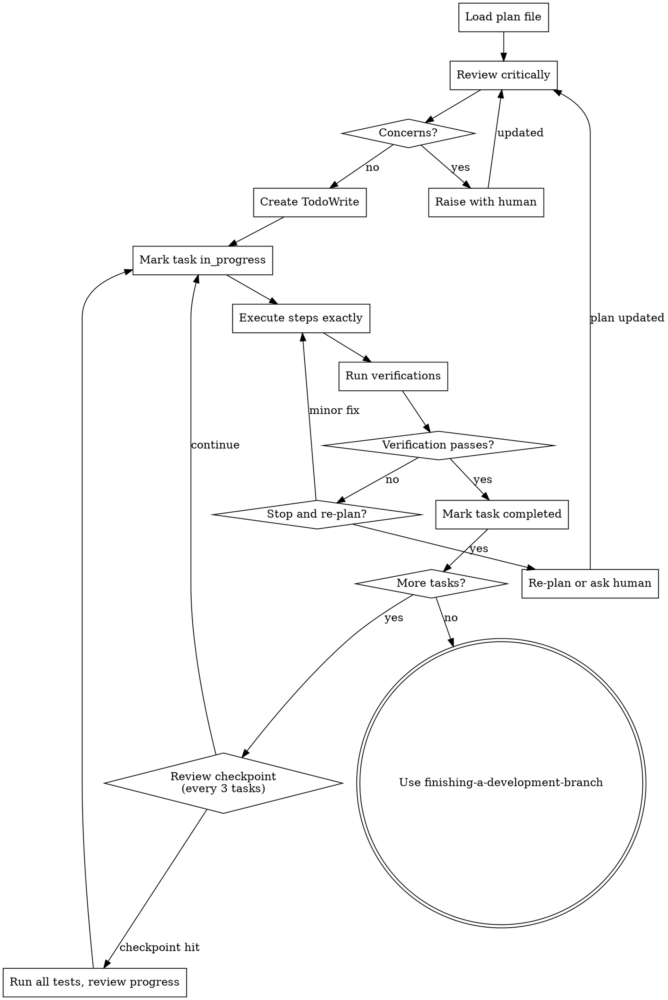

# Executing Plans

## Overview

Load plan, review critically, execute all tasks with review checkpoints, report when complete.

**Announce at start:** "I'm using the executing-plans skill to implement this plan."

**Note:** Tell your human partner that Superpowers works much better with access to subagents. The quality of its work will be significantly higher if run on a platform with subagent support (such as Claude Code or Codex). If subagents are available, use superpowers:subagent-driven-development instead of this skill.

## Process Flow

## The Process

### Step 1: Load and Review Plan
1. Read plan file
2. Review critically -- identify questions, gaps, or concerns about the plan
3. If concerns: Raise them with your human partner before starting
4. If no concerns: Create TodoWrite with all tasks and proceed

### Step 1b: Resuming Across Sessions

If you're picking up a plan that was started in a previous session, follow this startup protocol before executing tasks:

1. `pwd` and `git log --oneline -10` to orient yourself
2. Read `project-tracker.json` (same directory as plan file) if it exists
3. Read the plan file for context on the next task
4. Run the test suite to confirm a clean baseline -- catch any undocumented breakage before adding new code
5. Pick the highest-priority `not_started` or `in_progress` feature from the tracker
6. Announce: "Resuming [project]. Last session completed [X]. Starting [Y]."

If no `project-tracker.json` exists, fall back to reading the plan's Markdown checkboxes and git log to figure out where things stand.

### Step 2: Execute Tasks

For each task:
1. Mark as in_progress
2. Follow each step exactly (plan has bite-sized steps)
3. Run verifications as specified
4. Mark as completed
5. Commit after each task

**Review checkpoints:** After every 3 tasks, pause and run the full test suite. If anything broke, fix it before continuing. This catches integration issues early instead of at the end.

**Tracker updates (if `project-tracker.json` exists):**
- After each task completion + commit: set that task's `status` to `pass`, record the `commit` hash, set `completed_at`
- Update `last_session` block with today's date, tasks completed, and next priority
- If the session is ending mid-plan (context limit, user stops, or end of day): update `last_session.notes` with current state so the next session can pick up cleanly

### Step 3: Complete Development

After all tasks complete and verified:
- Announce: "I'm using the finishing-a-development-branch skill to complete this work."
- **REQUIRED SUB-SKILL:** Use superpowers:finishing-a-development-branch
- Follow that skill to verify tests, present options, execute choice

## When to Stop and Re-Plan

Not every failure means "try harder." Some failures mean the plan is wrong.

**STOP executing and re-plan when:**
- A task's assumptions are wrong (file doesn't exist, API changed, dependency missing)
- Two consecutive tasks fail verification
- You're writing code the plan didn't anticipate (scope creep signal)
- The approach from Task N makes Task N+2 impossible or ugly
- You've spent more than 3 attempts fixing a single verification failure

**STOP and ask the human when:**
- Plan has critical gaps preventing starting
- You don't understand an instruction
- The re-plan would change the architecture or scope
- You're unsure whether to re-plan or push through

**Don't force through blockers** -- stop and ask. Guessing wastes more time than asking.

## Common Mistakes

| Mistake | Why It Happens | What to Do Instead |
|---------|---------------|-------------------|
| Skipping plan review | "It looks fine, let me just start" | Always read critically. Plans have bugs too. |
| Modifying plan while executing | "I'll just adjust this one thing" | If the plan needs changes, stop and update the plan file first. |
| Skipping verifications | "The code looks right" | Run the verification. Looks-right code has bugs. |
| Continuing past failures | "I'll fix it after the next task" | Fix now. Failures compound. |
| Not committing per task | "I'll commit at the end" | Commit after each task. Atomic commits = easy rollback. |
| Adding unrequested features | "While I'm here, I should also..." | Follow the plan. Extra features go in a new plan. |
| Ignoring checkpoint reviews | "Tests passed last time" | Run full suite every 3 tasks. Integration bugs hide. |

## Red Flags

These thoughts mean STOP -- you're going off-plan:

| Thought | Reality |
|---------|---------|
| "The plan says X but Y would be better" | Update the plan first. Don't freelance. |
| "I'll just add this small thing" | Small things compound. Stick to the plan. |
| "This verification isn't important" | All verifications are important. Run them. |
| "I can fix this later" | Fix it now. Later never comes. |
| "The plan is probably outdated" | Check with the human. Don't assume. |

## Remember
- Review plan critically first
- Follow plan steps exactly
- Don't skip verifications
- Commit after each task
- Review checkpoint every 3 tasks
- Reference skills when plan says to
- Stop when blocked, don't guess
- Re-plan when the plan is wrong, don't patch around it
- Never start implementation on main/master branch without explicit user consent

## Integration

**Required workflow skills:**
- **superpowers:using-git-worktrees** - REQUIRED: Set up isolated workspace before starting
- **superpowers:writing-plans** - Creates the plan this skill executes
- **superpowers:finishing-a-development-branch** - Complete development after all tasks

**Alternative workflow:**
- **superpowers:subagent-driven-development** - Use when subagents are available (preferred)
